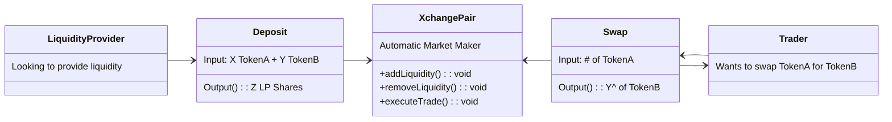

# How Xchange Works

Xchange is an automated liquidity protocol powered by a constant product formula and implemented in a system of non-upgradeable smart contracts on the Ethereum blockchain. It obviates the need for trusted intermediaries, prioritizing decentralization, censorship resistance, and security. Xchange is open-source software licensed under the GPL.

Each Xchange smart contract, or pair, manages a liquidity pool made up of reserves of two ERC-20 tokens.

Anyone can become a liquidity provider (LP) for a pool by depositing an equivalent value of each underlying token in return for pool tokens. These tokens track pro-rata LP shares of the total reserves, and can be redeemed for the underlying assets at any time.

Pairs act as automated market makers, standing ready to accept one token for the other as long as the “constant product” formula is preserved. This formula, most simply expressed as x \* y = k, states that trades must not change the product (k) of a pair’s reserve balances (x and y). Because k remains unchanged from the reference frame of a trade, it is often referred to as the invariant. This formula has the desirable property that larger trades (relative to reserves) execute at exponentially worse rates than smaller ones.

In practice, Xchange applies a 0.20% fee to trades, which is added to reserves. As a result, each trade actually increases k. This functions as a payout to LPs, which is realized when they burn their pool tokens to withdraw their portion of total reserves. 0.1% of the fee is a payout to LPs and 0.1% withheld as a protocol-wide revenue.

Because the relative price of the two pair assets can only be changed through trading, divergences between the Xchange price and external prices create arbitrage opportunities. This mechanism ensures that Xchange prices always trend toward the market-clearing price.

Ultimately, of course, the Xchange protocol is just smart contract code running on Ethereum. To understand how they work, head over to Smart Contracts.
