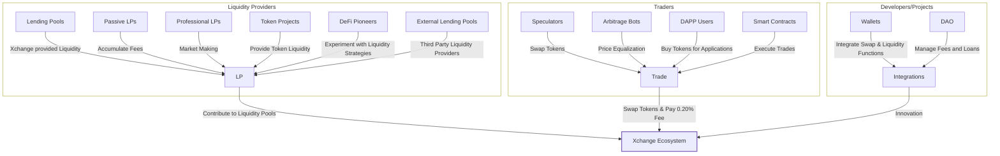

# Ecosystem Participants

The Xchange ecosystem is primarily comprised of three types of users: liquidity providers, traders, and developers. Liquidity providers are incentivized to contribute ERC-20 tokens to common liquidity pools. Traders can swap these tokens for one another for a fixed 0.30% fee (which goes to liquidity providers). Developers can integrate directly with Xchange smart contracts to power new and exciting interactions with tokens, trading interfaces, retail experiences, and more.

In total, interactions between these classes create a positive feedback loop, fueling digital economies by defining a common language through which tokens can be pooled, traded and used.

## Liquidity Providers

Liquidity providers, or LPs, are not a homogenous group:

Xchange provided Liquidity, through initial liquidity loans. External liquidity lenders who seek to provide a liquidity for loans in exchange for a share of the fees collected.

Passive LPs are token holders who wish to passively invest their assets to accumulate trading fees.

Professional LPs are focused on market making as their primary strategy. They usually develop custom tools and ways of tracking their liquidity positions across different DeFi projects.

Token projects sometimes choose to become LPs to create a liquid marketplace for their token. This allows tokens to be bought and sold more easily, and unlocks interoperability with other DeFi projects through Xchange.

Finally, some DeFi pioneers are exploring complex liquidity provision interactions like incentivized liquidity, liquidity as collateral, and other experimental strategies. Xchange is the perfect protocol for projects to experiment with these kinds of ideas.

## Traders

There are a several categories of traders in the protocol ecosystem:

Speculators use a variety of community built tools and products to swap tokens using liquidity pulled from the Xchange protocol.

Arbitrage bots seek profits by comparing prices across different platforms to find an edge. (Though it might seem extractive, these bots actually help equalize prices across broader Ethereum markets and keep things fair.)

DAPP users buy tokens on Xchange for use in other applications on Ethereum.

Smart contracts that execute trades on the protocol by implementing swap functionality (from products like DEX aggregators to custom Solidity scripts).

In all cases, trades are subject to the same flat fee for trading on the protocol. Each is important for increasing the accuracy of prices and incentivizing liquidity.

## Developers/Projects

There are far too many ways Xchange is used in the wider Ethereum ecosystem to count, but some examples include:

The open-source, accessible nature of Xchange means there are countless UX experiments and front-ends built to offer access to Xchange functionality. You can find Xchange functions in most of the major DeFi dashboard projects. There are also many Xchange-specific tools built by the community.

Wallets often integrate swapping and liquidity provision functionality as a core offering of their product.

DEX (decentralized exchange) aggregators pull liquidity from many liquidity protocols to offer traders the best prices by splitting their trades. Xchange is the biggest single decentralized liquidity source for these projects.

Smart contract developers use the suite of functions available to invent new DeFi tools and other various experimental ideas. See projects like Unisocks or Zora, among many, many others.
